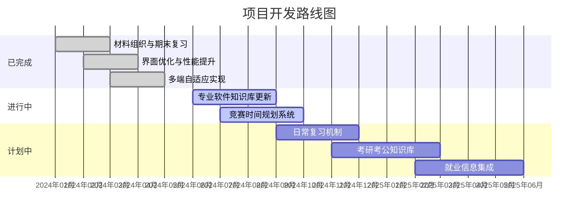

# 📚 复习知识库 - cailiao.github.io

一个基于 GitHub Pages 的多端自适应复习平台，旨在为学习者提供比传统 Word、PDF 更现代化的知识管理解决方案。

## ✨ 项目特色

### 🎯 核心优势
- **📱 多端自适应** - 完美适配电脑、平板、手机等多种设备
- **⚡ 极速加载** - 静态页面优化，克服 GitHub 网络延迟
- **🎨 美观界面** - 现代化设计，提升学习体验
- **🔄 持续更新** - 常态化知识库维护机制

### 🏗️ 技术架构
```
Markdown → HTML → GitHub Pages
    ↓
知识整理 → 页面生成 → 在线访问
```

## 📊 项目进展

### 🗓️ 更新路线图



### 📈 当前状态
| 模块 | 进度 | 状态 | 预计完成 |
|------|------|------|----------|
| 基础架构 | ✅ 100% | 已完成 | 2024-05 |
| 专业软件库 | 🔄 60% | 进行中 | 2024-09 |
| 竞赛规划 | 🔄 30% | 进行中 | 2024-10 |
| 日常复习 | ⏳ 0% | 计划中 | 2024-12 |
| 考研考公 | ⏳ 0% | 计划中 | 2025-03 |

## 🚀 快速开始

### 访问方式
- **主站点**: https://aeuicey.github.io/cailiao.github.io/
- **备用地址**: https://cailiao.github.io/

### 本地开发
```bash
# 克隆仓库
git clone https://github.com/aeuicey/cailiao.github.io.git

# 进入目录
cd cailiao.github.io

# 在浏览器中打开
open index.html
```

## 📁 项目结构

```
cailiao.github.io/
├── .github/workflows/    # GitHub Actions 工作流
├── html/                 # 生成的HTML页面
├── MD/                   # 原始Markdown文件
├── index.html           # 首页入口
├── list.html            # 内容列表页
└── README.md           # 项目说明
```

## 🎯 核心目标

### 短期目标（2024）
- [x] 完成基础材料组织架构
- [x] 实现响应式页面设计
- [ ] 完善专业软件知识库（盈建科、AutoCAD等）
- [ ] 建立竞赛时间规划系统

### 长期愿景（2025+）
- [ ] 建立常态化复习机制
- [ ] 集成考研考公知识体系
- [ ] 构建就业信息平台
- [ ] 推动个人与集体学习进度协同

## 🔄 更新机制

### 内容更新流程
1. **知识收集** → Markdown 格式整理
2. **格式转换** → 自动生成 HTML
3. **页面发布** → GitHub Pages 部署
4. **多端同步** → 即时生效访问

### 更新频率
- **日常更新**: 专业知识库每日维护
- **周期更新**: 竞赛信息每周同步
- **重大更新**: 架构优化按需发布

## 🤝 参与贡献

我们欢迎以下形式的贡献：
- 📝 知识内容补充与修正
- 💻 技术优化与功能开发  
- 🐛 问题反馈与建议
- 📚 学习资源分享

## 📄 许可证

本项目采用开源许可证，具体信息请查看 [LICENSE] 文件。

## 📞 联系我们

如有问题或建议，请通过以下方式联系：
- GitHub Issues: https://github.com/aeuicey/cailiao.github.io/issues
- 邮箱: 项目维护者邮箱

---

*最后更新: 2024年12月*  
*让我们一起打造更好的学习平台！* 🚀
